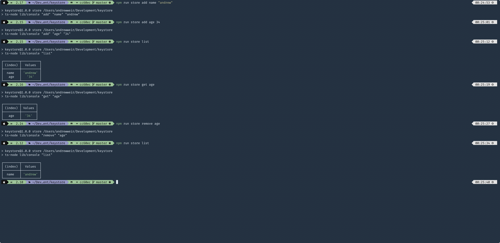
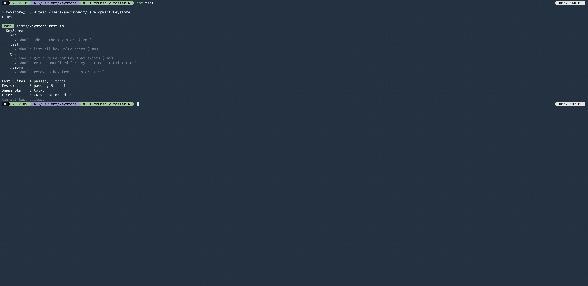

## Instructions

    $ npm install
    $ npm run build
    $ npm test
    $ npm run coverage

# Store API

    $ ./store help
    $ ./store add mykey myvalue
    $ ./store list
    $ ./store get mykey
    $ ./store remove mykey

### Demo Images

#### Operations

#### Tests

