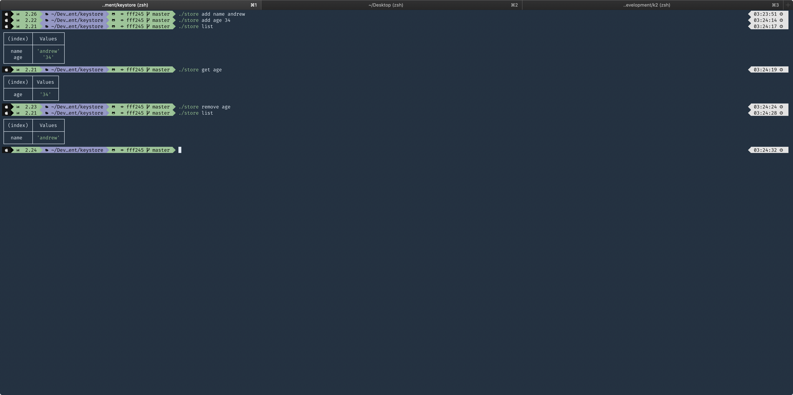

## Instructions

    $ npm install
    $ npm test
    $ npm run coverage

# Store API

    $ npm run store help
    $ npm run store add mykey myvalue
    $ npm run store list
    $ npm run store get mykey
    $ npm run store remove mykey

### Contents of .gitignore

    .vscode
    node_modules
    coverage
    store.json
    test.json

### Contents of .prettierrc

    {
      "trailingComma": "all",
      "arrowParens": "always",
      "semi": true,
      "singleQuote": true
    }

### Demo Images

#### Operations

#### Tests

